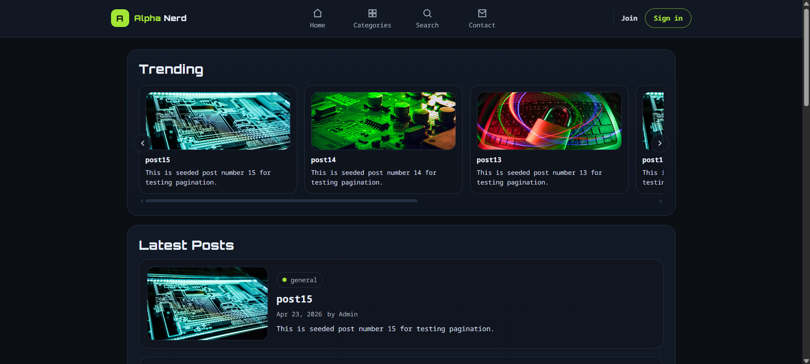
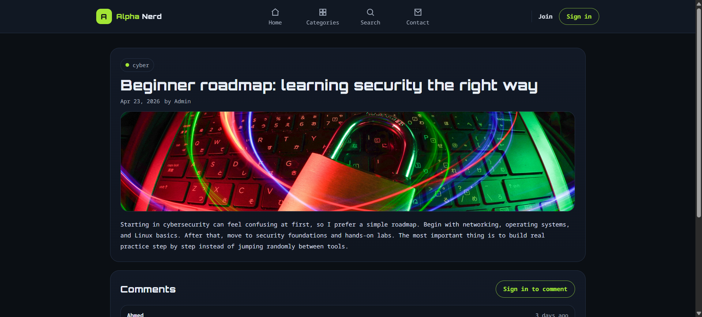
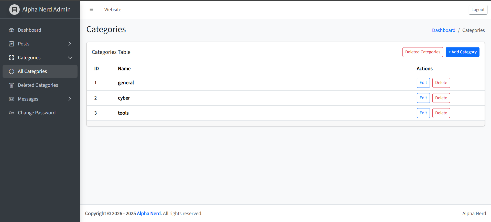
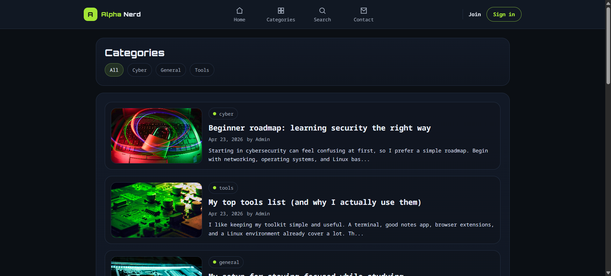
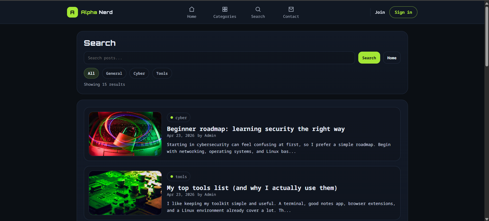

# Alpha Nerd - Laravel Blog & Admin Dashboard

Alpha Nerd is a Laravel personal blog project with a public website and an admin dashboard.  
The system allows admins to manage posts, categories, comments, and contact messages, with support for authentication, image uploads, search, pagination, and soft delete.

## Features

### Public Website
- Homepage
- Posts listing page
- Single post details page
- Categories page
- Search functionality
- Contact page
- Contact form that stores messages in the database

### Admin Dashboard
- Admin dashboard overview
- Posts CRUD
- Categories CRUD
- Comments management
- Contact messages management
- Soft delete, restore, and force delete
- Image upload for posts
- Pagination for large data lists

### Authentication
- Login system using Laravel Breeze
- Register page
- Forgot password page
- Change password page
- Protected admin dashboard
- Admin-only access for management pages

## Screenshots

### Public Website

#### Homepage


#### Posts Page


#### Single Post Page


#### Post Comments


#### Categories Page


#### Category Posts Page


#### Search Results


#### Contact Page


### Authentication Pages

#### Login Page


#### Register Page


#### Forgot Password Page


#### Change Password Page


### Admin Dashboard

#### Dashboard Overview


#### Posts Management


#### Create Post


#### Edit Post


#### Deleted Posts


#### Categories Management


#### Edit Category


#### Deleted Categories


#### Contact Messages Management


#### Deleted Messages


## Tech Stack

- Laravel 13
- PHP
- MySQL
- Blade
- Laravel Breeze
- HTML
- CSS
- JavaScript
- Git & GitHub

## Main Database Tables

- users
- posts
- categories
- comments
- contact_messages

## Installation

Clone the repository:

```bash
git clone https://github.com/ahmdan4-hue/alpha-nerd-project.git
```

Move into the project folder:

```bash
cd alpha-nerd-project
```

Install PHP dependencies:

```bash
composer install
```

Install frontend dependencies:

```bash
npm install
```

Create the environment file:

```bash
cp .env.example .env
```

Generate the application key:

```bash
php artisan key:generate
```

Configure your database in the `.env` file:

```env
DB_DATABASE=alpha_nerd
DB_USERNAME=root
DB_PASSWORD=
```

Run migrations and seeders:

```bash
php artisan migrate --seed
```

Create the storage link:

```bash
php artisan storage:link
```

Start the Laravel server:

```bash
php artisan serve
```

Run Vite:

```bash
npm run dev
```

Now open:

```text
http://127.0.0.1:8000
```

## Project Purpose

This project was built as a practical Laravel portfolio project to apply backend development concepts such as routing, controllers, models, migrations, Eloquent relationships, authentication, CRUD operations, validation, file uploads, pagination, search, and soft delete.

The project also reflects secure web development basics such as protected admin routes, request validation, CSRF protection, authenticated access, and role-based dashboard access.

## Author

Ahmed  
4th-year Cybersecurity student at UCAS  
Interested in Laravel backend development, secure web applications, and cybersecurity.
