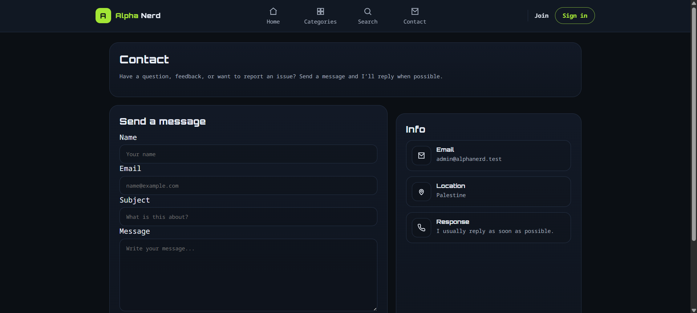
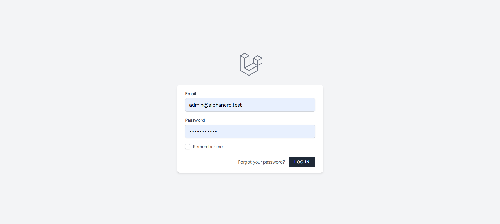
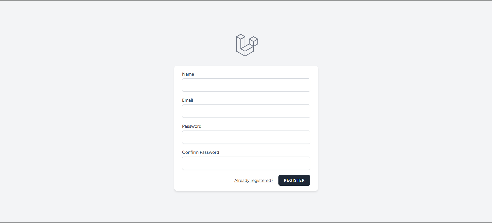
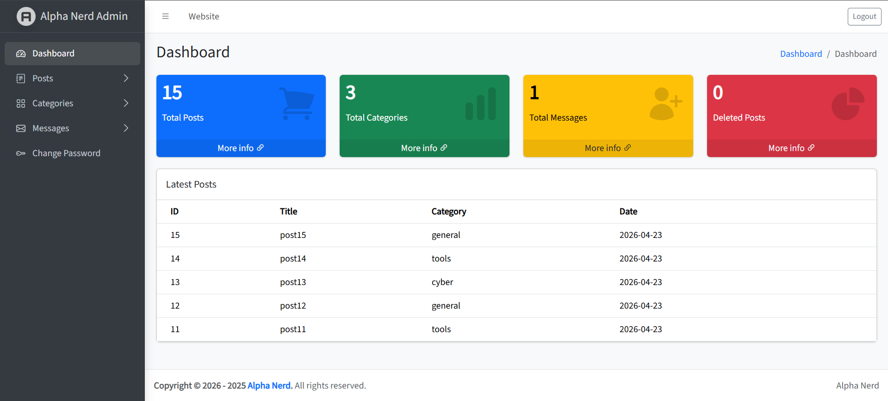

# Alpha Nerd - Laravel Blog & Admin Dashboard

Alpha Nerd is a Laravel personal blog project with a public website and an admin dashboard.

The system allows admins to manage posts, categories, comments, and contact messages, with support for authentication, image uploads, search, pagination, and soft delete.

---

## Requirements

Before running the project, make sure you have:

- PHP 8.2 or higher
- Composer
- MySQL or MariaDB
- Node.js and npm
- Git
- A local server environment such as WAMP, XAMPP, Laragon, or Laravel Herd

Recommended local stack:

```text
PHP 8.2+
Composer
MySQL
Node.js
npm
Laravel 13
```

---

## Important Note About Laravel Breeze

This project uses **Laravel Breeze** for authentication.

If you cloned this completed repository, Breeze files should already be included in the project. In that case, you usually only need to run:

```bash
composer install
npm install
npm run build
```

Do **not** run `php artisan breeze:install blade` again unless the authentication files are missing, because it can overwrite existing auth views, routes, and layout files.

If you are building the project from a fresh Laravel installation, install Breeze before running migrations:

```bash
composer require laravel/breeze --dev
php artisan breeze:install blade
npm install
npm run build
```

Then continue with the normal database setup and migrations.

---

## Features

### Public Website

- Homepage
- Posts listing page
- Single post details page
- Categories page
- Search functionality
- Contact page
- Contact form that stores messages in the database
- Post comments display
- Dark and light mode UI

### Admin Dashboard

- Admin dashboard overview
- Posts CRUD
- Categories CRUD
- Comments management
- Contact messages management
- Soft delete, restore, and force delete
- Image upload for posts
- Pagination for large data lists
- Dark and light mode dashboard theme

### Authentication

- Login system using Laravel Breeze
- Register page
- Forgot password page
- Change password page
- Protected admin dashboard
- Admin-only access for management pages

---

## Tech Stack

- Laravel 13
- PHP
- MySQL
- Blade
- Laravel Breeze
- HTML
- CSS
- JavaScript
- Git and GitHub

---

## Main Database Tables

- users
- posts
- categories
- comments
- contact_messages

---

## Installation

### 1. Clone the repository

```bash
git clone https://github.com/ahmdan4-hue/alpha-nerd-project.git
```

### 2. Move into the project folder

```bash
cd alpha-nerd-project
```

### 3. Install PHP dependencies

```bash
composer install
```

### 4. Install frontend dependencies

```bash
npm install
```

### 5. Create the environment file

On Windows:

```bash
copy .env.example .env
```

On macOS/Linux:

```bash
cp .env.example .env
```

### 6. Generate the application key

```bash
php artisan key:generate
```

### 7. Configure the database

Create a database in MySQL, for example:

```text
alpha_nerd
```

Then update your `.env` file:

```env
DB_CONNECTION=mysql
DB_HOST=127.0.0.1
DB_PORT=3306
DB_DATABASE=alpha_nerd-project
DB_USERNAME=root
DB_PASSWORD=
```

### 8. Run migrations and seeders

```bash
php artisan migrate --seed
```

### 9. Build frontend assets

For development:

```bash
npm run dev
```

For a production-ready build:

```bash
npm run build
```

### 10. Start the Laravel server

```bash
php artisan serve
```

Open the project in your browser:

```text
http://127.0.0.1:8000
```

---

## Quick Setup Commands

You can use this quick version after cloning the project:

```bash
composer install
npm install
copy .env.example .env
php artisan key:generate
php artisan migrate --seed
npm run build
php artisan serve
```

For macOS/Linux, replace:

```bash
copy .env.example .env
```

with:

```bash
cp .env.example .env
```

---

## Frontend Assets Note

This project mainly uses public assets and post images from the `public` directory.

Because of that, `php artisan storage:link` is not required for uploaded post images if they are stored inside the public upload path used by the project.

If you change the upload logic to use Laravel storage, then you may need:

```bash
php artisan storage:link
```

---

## Screenshots

### Public Website

#### Homepage


#### Post Page


#### Post Comments


#### Categories Page


#### Search Results


#### Contact Page



---

### Authentication Pages

#### Login Page



#### Register Page



#### Forgot Password Page


#### Change Password Page


---

### Admin Dashboard

#### Dashboard Overview



#### Posts Management


#### Create Post


#### Edit Post


#### Deleted Posts


#### Categories Management


#### Create Category


#### Edit Category


#### Deleted Categories


#### Contact Messages Management


#### Deleted Messages


---

## Project Purpose

This project was built as a practical Laravel portfolio project to apply backend development concepts such as:

- Routing
- Controllers
- Models
- Migrations
- Eloquent relationships
- Authentication
- CRUD operations
- Request validation
- File uploads
- Pagination
- Search
- Soft delete

The project also reflects secure web development basics such as protected admin routes, request validation, CSRF protection, authenticated access, and admin-only dashboard access.

---

## Authors

Ahmed Hamdan  
Fadi Salama  

4th-year Cybersecurity students at UCAS.

Interested in Laravel backend development, secure web applications, and cybersecurity.
